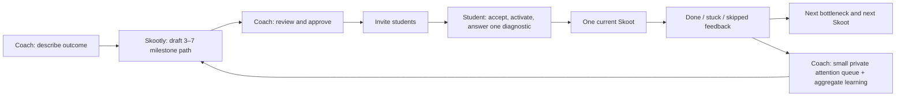

# Skootly Creator & Coach Pack MVP: From “Download My Brain” to Guided Execution

**Purpose.** This analysis defines the smallest product loop that lets a creator or coach turn an existing method into a usable Skoot Pack, invite students, guide each student through the right next action, and learn from execution feedback. The recommendation is intentionally not a course builder, CRM, or generic AI chatbot. It is a **guided execution layer** that stays faithful to Skootly’s core promise: *do less, move forward.*

> **Design principle:** Coaches should not have to “download their brain.” They should be able to describe the transformation, verify a short proposed path, and improve it from real student feedback.

## What the supplied 5-Day Challenge package establishes

The supplied Google Doc contains one explicit instruction—**“Step 1: update the cover to the new date”**—plus a configuration screenshot for a private “5 Day Group Money AI Challenge.” The screenshot establishes a concrete challenge identity, an owner-managed group URL, a private-membership setting, a support contact, and asset specifications: **128 × 128** for the icon and **1084 × 576** for the cover.[1] The displayed promise is to turn strangers into qualified prospects and paying clients through a five-day system without a large group.[1]

The source is therefore a strong example of a **launch-and-execution Pack**, but it is not a complete written curriculum. Skootly should not invent the absent lessons or rules. It should let the coach turn this type of existing material into a reviewable execution path: a clear outcome, a short sequence of milestones, reusable Skoot recipes, and student feedback prompts.

| Verified source element | What it should become in Skootly | What Skootly must not do |
| --- | --- | --- |
| “Update the cover to the new date” | A launch Skoot with an editable date field, cover brief, `1084 × 576` requirement, and a user-supplied group-settings link | Upload, navigate to private settings, or change the group without explicit user confirmation |
| Private challenge group | A cohort-scoped Pack with private enrollment and coach support routing | Treat it as a public Pack marketplace or inspect community data automatically |
| Challenge promise | The Pack’s single **Point B** destination | Turn it into a long dashboard of broad objectives |
| Group icon and cover | Optional asset requirements attached to one Skoot | Store or publish customer media without a deliberate content workflow |

## Current foundation and the usability gap

Skootly already has the right conceptual foundation: creator-owned Pack versions, reviewable knowledge proposals, student assignments, Pack-aware diagnostics, one primary Skoot plus an optional supporting Skoot, outcome capture, and a privacy-bounded escalation path.[2] The student journey specification is also directionally correct: the Pack defines Point B; the student’s context defines Point A; Skootly identifies the bottleneck and supplies the next turn.[3]

The principal gap is not more intelligence. It is the **operating workflow around the intelligence**. Today, Pack setup is still closer to an internal configuration area: create a Pack, describe it, type what changed, approve a rule, and assign an already-existing user by exact email. That works for an informed product tester. It does not yet feel like a coach inviting a cohort and calmly turning a known method into a guided experience.

| Capability | Present foundation | MVP usability gap to close |
| --- | --- | --- |
| Coach knowledge | Free-form rule proposal and approval | No guided “turn my method into a path” flow or starter template |
| Pack structure | Principles, rules, milestones, scripts, and Not-Today guidance are supported | No visible, editable execution map that a coach can review in under ten minutes |
| Student assignment | Assignment by an existing user’s exact email | No invitation, acceptance, activation, or enrollment status |
| Student guidance | Pack-aware diagnosis and bounded next actions | No explicit coach-authored Skoot recipe tied to a visible current milestone |
| Feedback | Completion, outcomes, skips, escalation, and aggregate signals | No compact coach-facing “who needs attention and what did this step teach us?” loop |
| Versions | Approved versions are immutable | No deliberate rollout choice for active versus newly enrolled students |

## The usable MVP experience

The MVP should center on **one moment of trust** for each role. For the coach, it is: *“I can turn my method into a cohort-ready path without becoming a software administrator.”* For the student, it is: *“I know exactly what to do next, why it matters, and how to tell my coach when I am blocked.”*

### 1. Coach activation: a Pack Builder, not a blank page

The first creator screen should offer one clear decision: **“What are you helping people achieve?”** The coach chooses a starter shape—**5-Day Challenge**, **Client Implementation**, **Evergreen Transformation**, or **Build from my outline**—rather than starting from a blank Pack. The selected template supplies a lightweight scaffold, not a fixed methodology.

The coach should then move through five short prompts, one at a time: the Point B outcome; who the Pack is for; the 3–7 moments that prove progress; the most common stall at each moment; and the action a student should take when that stall appears. Existing sales-page copy, a curriculum outline, lesson notes, or a pasted transcript can be used as source material. Skootly may propose a structured draft, but each item must remain editable and must require coach approval before becoming active.

The output is a **Pack Map**. It is one calm page showing the outcome at the top and a vertical path beneath it. Each milestone contains only its title, “done looks like,” common bottleneck, default Skoot, optional resource link, and one feedback question. This is the coach’s method expressed operationally without forcing them to write decision trees or prompt-engineer an AI.

| Pack Map field | Coach-friendly prompt | Student behavior after approval |
| --- | --- | --- |
| Destination | “At the end, what can they reliably do or achieve?” | Sees a concrete Point B, not an abstract course title |
| Milestone | “What must be true before they move on?” | Sees only the current milestone and a quiet preview of what follows |
| Common stall | “Where do capable students usually hesitate?” | Receives a focused diagnostic only when needed |
| Default Skoot | “What is the smallest action that gets them moving again?” | Receives this action as the primary Skoot, adapted only with their own context |
| Definition of done | “What evidence tells you this step worked?” | Can report completion in a meaningful, short form |
| Feedback prompt | “What do you need to know to improve this step?” | Gives structured execution feedback after done, stuck, or skipped |

### 2. Template first: use the 5-Day Challenge as the authoring model

The 5-Day Challenge template should prefill the *shape*, not make up the coach’s content. It should ask the coach to name the challenge, state the transformation, set a cohort start date, and review five editable milestone cards. Each day may hold one prescribed action and, only when necessary, one supporting action. The current-day card should support asset requirements such as the documented `1084 × 576` cover and a user-provided settings link, with the existing external confirmation rule preserved.[1]

The key usability device is **“Coach in plain English → Skootly drafts cards → coach edits the cards.”** A coach should be able to paste: “Before promoting their challenge, students must update the cover with the new date and write one promise-led group description.” Skootly should show two proposed cards, the asset specifications, and a preflight checklist. The coach changes wording directly, moves cards by drag-and-drop, or deletes them. Only the approved cards become Pack version content.

### 3. Invitation and enrollment: make assignment feel like enrollment

“Assign an existing Skootly user by exact email” is a secure back-office primitive, but it is not a coach experience. Replace the visible language with **Invite students** and model the state explicitly: *drafted → sent → opened → account created → accepted → active → completed / paused*.

The first release can have two invitation channels. A coach can enter one or more email addresses and copy a unique, expiring enrollment link for manual delivery. The next release should send branded invitations itself after a transactional email provider and domain authentication are configured. The link opens a Pack-branded acceptance screen: “You’ve been invited by [Coach] to [Pack]. Here is the outcome, time commitment, and what happens next.” The student creates an account or signs in, verifies their email, accepts the invitation, and is enrolled in a specific Pack version.

Email verification is a prerequisite for safe invitation delivery and private coach/student relationships. It prevents a newly created but unverified account from receiving Pack access or support information intended for someone else. Password reset should arrive with the same email capability. Until then, Skootly can offer copyable enrollment links but should not present email delivery as complete.

### 4. Student execution: show the next turn, not the whole syllabus

Once enrolled, a student should not land in a generic check-in or a long curriculum. The welcome surface should show the coach’s Pack name, Point B, current milestone, and one fast Point A question. After that, the student always sees one dominant action card.

The action card should contain the action, a short “why now” sentence, the definition of done, an optional coach-approved resource, and three honest buttons: **I did it**, **I’m stuck**, and **Not today**. “I did it” asks for a short result or evidence appropriate to the milestone. “I’m stuck” asks one blocking question and either supplies a Pack-specific alternative Skoot or offers the existing private help escalation. “Not today” captures a brief reason and keeps the next decision visible without shaming the student.

This creates a decisive behavior loop:

> **Current milestone → one next Skoot → honest execution signal → updated Point A → next Skoot or the lowest-cost support path.**

The student may see a narrow “Your path” rail with past milestones checked, the current one expanded, and future milestones intentionally quiet. This gives motivation without turning Skootly into a task list.

### 5. Coach feedback: a small operating view, not analytics theater

The coach needs a short daily operating view with three sections: **Moving**, **Needs attention**, and **What to improve in the Pack**. “Moving” gives a simple completion count; “Needs attention” surfaces only students who are explicitly stuck, repeatedly skipping, or requesting help; “What to improve” shows anonymous patterns such as “students are unclear on defining the offer before Day 2.” Private conversations and raw student notes remain private by default.

For each Pack update, Skootly must show a rollout choice. The safe default should be: **new enrollments receive the newest approved version; active students keep their current version until a milestone boundary.** The coach may deliberately apply a revision to all active students’ next Skoots, but the product should explain the effect before doing so. This is more trustworthy than silently swapping a student’s route halfway through a cohort.

| Feedback signal | Student input | Coach sees | Pack improvement path |
| --- | --- | --- | --- |
| Completion | Outcome / evidence prompt | Progressed milestone count | Keep or refine the action definition |
| Stuck | One blocking question | Named student in private support queue | Add a fallback Skoot or improve the instruction |
| Skip | Reason category | Aggregated pattern, plus private intervention only when necessary | Simplify or resequence the Skoot |
| Help request | Explicit request | Private escalation with pre-call context | Support student; propose Pack change for review |
| Repeated feedback | Structured end-of-step prompt | Anonymous theme | Draft an editable Pack update; never publish it automatically |

## Recommended minimum data model and decision rules

The existing Pack knowledge and immutable versioning can be retained, but the product needs a small structured execution layer. Each new record should remain user/creator-owned, tenant-scoped, and reviewable.

| New or strengthened record | Purpose | MVP rule |
| --- | --- | --- |
| `pack_blueprint` | Draft outcome, audience, cadence, and cohort model | It is a draft until explicitly published |
| `pack_milestone` | Ordered progress point with definition of done | Three to seven milestones; avoid granular task trees |
| `pack_skoot_template` | Coach-approved default action, fallback action, resource, asset requirements, feedback questions | One primary action and optional one supporting action only |
| `enrollment_invite` | Email, Pack/version, signed expiry, invite status | Never exposes student data; token is one-time and revocable |
| `enrollment` | Accepted Pack/version, active milestone, progress state | Version is pinned at acceptance; rollout is intentional |
| `skoot_execution_feedback` | Done, stuck, skipped, result, and coach-safe aggregate category | Private student detail; aggregate only for Pack intelligence |
| `pack_rollout` | Version application policy | Default to new enrollments; active students require an explicit policy |

The recommendation engine should first look for the current milestone’s coach-approved Skoot template. It may tailor wording and use the student’s own Point A context, but it must not replace a coach-defined sequence with a generic AI suggestion. When the Pack lacks a rule for the situation, Skootly should ask one diagnostic question, give a conservative next action, or escalate—never fabricate methodology.

## Build sequence: make one coach successful before broadening scope

The immediate MVP should optimize for **one coach, one Pack, one small cohort, one clear transformation**. The following order creates a usable loop before adding more integrations or analytics.

| Priority | Build slice | Why it comes now | MVP acceptance test |
| --- | --- | --- | --- |
| **P0** | Pack Builder with the 5-Day Challenge and Client Implementation templates | Eliminates blank-page “download my brain” friction | A coach can approve a destination, 3–7 milestones, and a default Skoot per milestone in one sitting |
| **P0** | Editable Pack Map and review-before-publish version flow | Makes the coach trust the product’s interpretation | No student guidance changes until the coach approves a draft version |
| **P0** | Enrollment invitation and Pack-branded acceptance page | Converts assignment into an actual coach workflow | A coach can create an expiring invite, a student can accept it, and their enrollment state is visible |
| **P0** | Milestone-bound action templates and Done/Stuck/Not Today feedback | Turns a Pack into step-by-step execution rather than static knowledge | A student sees only the next Skoot and advances based on meaningful feedback |
| **P0** | Minimal cohort operating view and intentional version rollout | Closes the coach learning loop without dashboard sprawl | Coach can identify stuck students and choose how an approved update reaches active students |
| **P1** | Verified-email invitation sending and password reset | Makes invitations dependable and safer at scale | Coaches can send branded invites; only verified recipients enroll |
| **P1** | Import assistant for course outlines, lesson notes, and approved transcripts | Speeds Pack creation using existing materials | Coach can convert a pasted outline into editable milestone/action drafts |
| **P1** | Small cohort templates and duplicate/clone Pack | Supports repeated launches without reauthoring | Coach can clone last cohort, update date/assets, and invite a new group |
| **Later** | CRM automations, calendar scheduling, publishing, marketplace, advanced analytics, multi-creator permissions | These add operational weight before the execution loop is validated | Not required to prove students trust and follow their next Skoot |

## Product decisions to make before implementation

The product can move quickly once four decisions are made. First, define the initial Pack shapes: the analysis recommends **5-Day Challenge** and **Client Implementation**. Second, decide whether a Pack version is pinned at student acceptance or can update at milestone boundaries; the recommended default is pinned with a deliberate rollout control. Third, select the invitation launch channel: copyable signed links first, then branded email after an email service and verification are enabled. Fourth, agree on the minimum student proof for each Skoot—short result, confidence, and “what blocked you?” are generally sufficient; screenshots and recordings should remain opt-in and out of scope.

## Bottom line

Skootly should not ask a coach to write a large prompt or build a course. It should ask them to **approve a short operational map of how their students move from Point A to Point B**. The Pack then deploys as a calm, milestone-aware next action system. Students execute one Skoot at a time; their honest completion, stuck, and skip signals improve the Pack; and the coach gets only the attention and improvement cues that matter.

The best next product slice is therefore the **Pack Builder + enrollment acceptance + milestone-bound Skoot feedback loop**. It is the shortest path from the current Creator Pack foundation to a coach experience that feels easy to set up, useful to deploy, and measurably better with every cohort.

## References

[1]: https://docs.google.com/document/d/15bhne6RLmVnp6oW-n1ASV94FXTG5KpG_Q1bslN1QMjo/edit "GC | 5 day challenge Skoot Package"
[2]: ./creator-skoot-pack-mvp-spec.md "Creator Skoot Packs — Incremental MVP"
[3]: ./guided-pack-journey-spec.md "Guided Skoot Pack Journey — Incremental Implementation"
